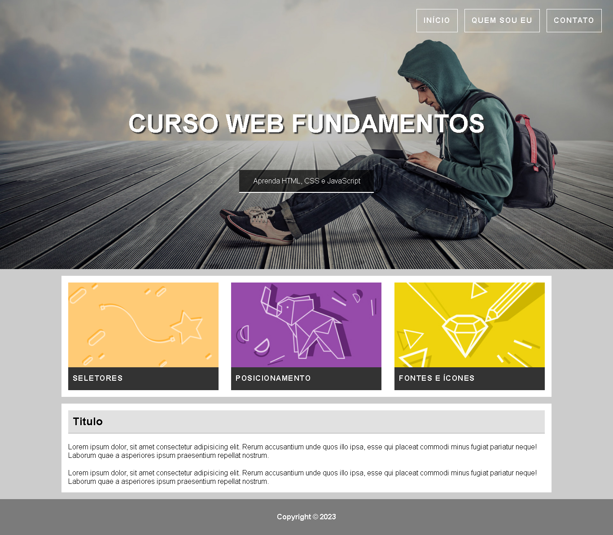

<h1 align="center">
     <a href="#" alt="website de agencia de viagem">Projeto 1 - Fundamentos</a>
</h1>

<h3 align="center">
    ✈️ Primeiro projeto do curso utilizando apenas HTML e CSS
</h3>

<h4 align="center">
	🚧 concluído 🚀 🚧
</h4>

 

  

## 💻 Sobre o projeto

✈️  É um projeto que tem como objetivo reproduzir uma simples página web. Foi exercitado conceitos como: semântica, posicionamento, estilização no geral etc.

## 🧠 Aprendizados

- Não utilizar letras maiúsculas no HTML, leitor de tela pode ler a palavra como uma sigla (acessibilidade)
- Utilizar seletores do tipo classe ao invés de tag no CSS, facilita a manutenção do código

## 🛠 Tecnologias

As seguintes ferramentas foram usadas na construção do projeto:

### **Website**  

-   **[HTML](https://developer.mozilla.org/pt-BR/docs/Web/HTML)**
-   **[CSS](https://developer.mozilla.org/pt-BR/docs/Web/CSS)**

### **Utilitários**

-   Editor:  **[Visual Studio Code](https://code.visualstudio.com/)**  

---

 <b>Feito por Calebe Felipe 👋🏽</b>  
 
  
 <a href="#top">Volte para o topo</a>